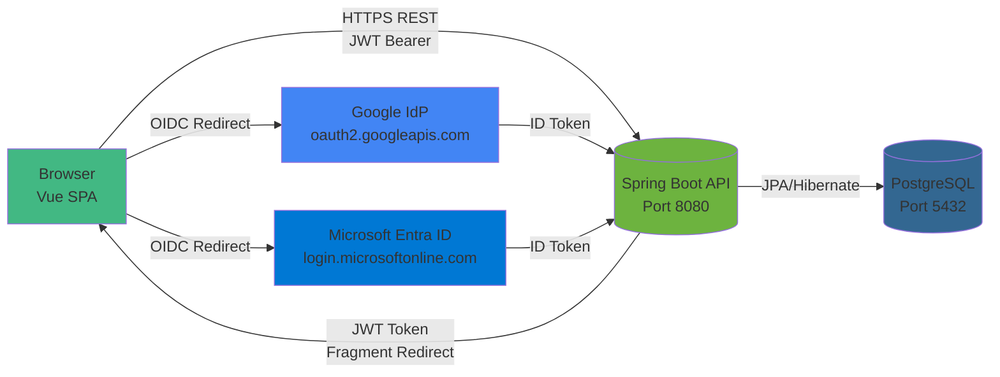

# Kiến trúc Tổng quan

## Sơ đồ Kiến trúc



## Tổng quan Module

### Frontend (Vue 3 SPA)
- **Framework**: Vue 3 với Composition API và TypeScript
- **Build Tool**: Vite
- **State Management**: Pinia
- **Routing**: Vue Router (hash mode)
- **HTTP Client**: Axios với interceptors
- **Port**: 5173 (development), 80 (production)

**Tính năng chính**:
- Local login/register form
- OAuth2 redirect buttons (Google, Microsoft)
- OIDC callback handler
- Protected routes với route guards
- JWT token storage (localStorage)

### Backend (Spring Boot)
- **Framework**: Spring Boot 3.1.x
- **Security**: Spring Security 6.3
- **OAuth2**: Spring OAuth2 Client
- **Persistence**: Spring Data JPA + PostgreSQL
- **Database Migration**: Flyway
- **JWT**: JJWT library
- **Port**: 8080

**Tính năng chính**:
- RESTful API endpoints
- JWT authentication filter
- OAuth2 success handler
- BCrypt password hashing
- CORS configuration
- Sessionless (stateless) architecture

### Database (PostgreSQL)
- **Version**: PostgreSQL 16
- **Port**: 5432
- **Schema**: Managed by Flyway migrations

**Tables**:
- `users`: User accounts (local + OAuth)
- `roles`: Role definitions (ROLE_USER, ROLE_ADMIN)
- `user_roles`: Many-to-many relationship

## Sessionless Architecture với JWT

### Tại sao JWT?

1. **Stateless**: Không cần lưu session trên server → dễ scale horizontal
2. **SPA-friendly**: Token có thể lưu client-side, không cần cookie
3. **Microservices-ready**: Token có thể verify độc lập giữa các services
4. **Mobile-friendly**: Token có thể dùng cho mobile apps

### Token Flow

```
User Login → Backend validates → Issues JWT → Client stores token
→ Client sends token in Authorization header → Backend validates token
→ Access granted/denied
```

### Token Structure

```json
{
  "iss": "demo-app",
  "sub": "user@example.com",
  "roles": ["ROLE_USER", "ROLE_ADMIN"],
  "iat": 1234567890,
  "exp": 1234571490
}
```

**Claims**:
- `iss` (issuer): Application identifier
- `sub` (subject): User email
- `roles`: User roles array
- `iat` (issued at): Timestamp
- `exp` (expiration): Timestamp (default: 1 hour)

## Security Layers

1. **Network**: HTTPS/TLS (production)
2. **Authentication**: JWT Bearer tokens
3. **Authorization**: Role-based access control (RBAC)
4. **Password**: BCrypt hashing (cost factor 10)
5. **CORS**: Whitelist origins
6. **CSRF**: Disabled for API (stateless with JWT)

## Deployment Architecture

```
┌─────────────────────────────────────────┐
│         Docker Compose Stack            │
├─────────────────────────────────────────┤
│  ┌──────────┐  ┌──────────┐  ┌────────┐│
│  │ Frontend │  │ Backend  │  │   DB   ││
│  │  (Nginx) │  │ (Spring) │  │(Postgres)│
│  │  :5173   │  │  :8080   │  │  :5432 ││
│  └──────────┘  └──────────┘  └────────┘│
└─────────────────────────────────────────┘
```

## Data Flow

### Local Authentication
```
User → Vue Form → POST /api/auth/login → Backend validates credentials
→ BCrypt verify → Issue JWT → Return token → Vue stores in localStorage
```

### OAuth2 Authentication
```
User → Click "Google/Microsoft" → Redirect to /oauth2/authorization/{provider}
→ Backend redirects to IdP → User authenticates at IdP
→ IdP redirects back with code → Backend exchanges code for ID token
→ Backend extracts email/name → Upsert user → Issue JWT
→ Redirect to frontend with token in URL fragment → Vue extracts and stores
```

