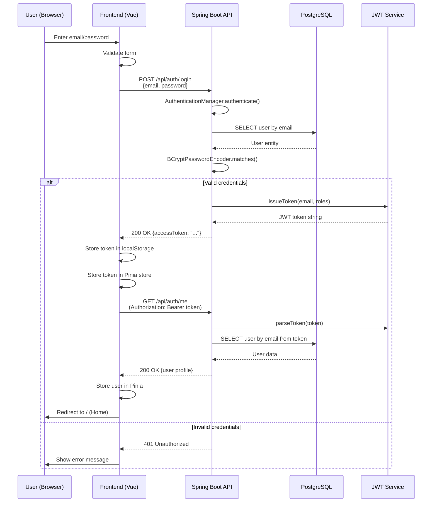
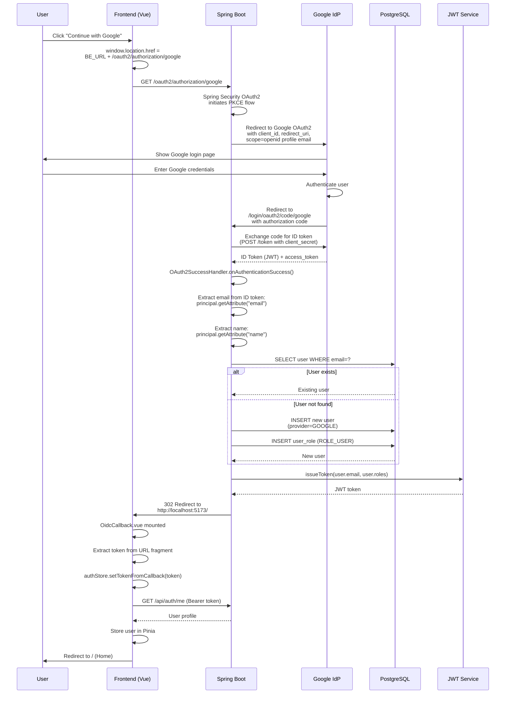
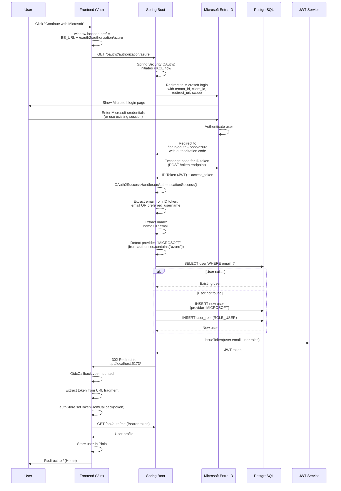
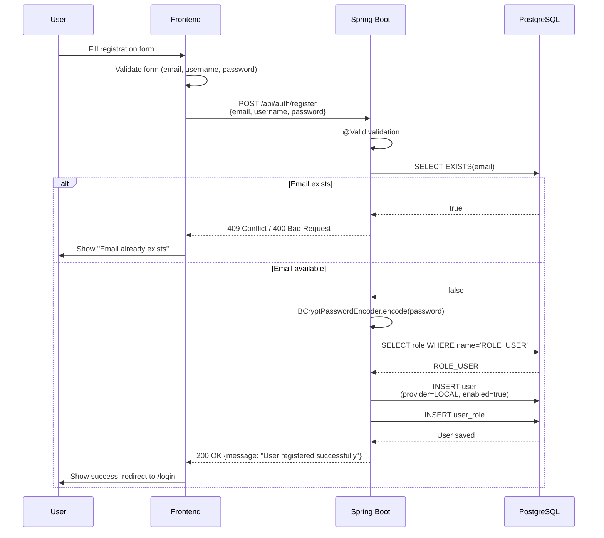

# Authentication Flows

Tài liệu này mô tả chi tiết các flow đăng nhập trong hệ thống.

## 1. Local Login Flow (Email/Password)

### Sequence Diagram



### API Request/Response

**Request**:
```http
POST /api/auth/login
Content-Type: application/json

{
  "email": "user@local.dev",
  "password": "User@123"
}
```

**Response (Success)**:
```json
{
  "accessToken": "eyJhbGciOiJIUzI1NiIsInR5cCI6IkpXVCJ9..."
}
```

**Response (Error)**:
```json
{
  "timestamp": "2024-01-01T12:00:00Z",
  "status": 401,
  "error": "Unauthorized",
  "message": "Bad credentials"
}
```

## 2. Google OIDC Flow

### Sequence Diagram



### Google OAuth2 Configuration

**Required Setup**:
1. Tạo OAuth 2.0 Client ID tại [Google Cloud Console](https://console.cloud.google.com/)
2. Authorized redirect URI: `http://localhost:8080/login/oauth2/code/google`
3. Scopes: `openid`, `profile`, `email`

**ID Token Claims**:
```json
{
  "sub": "123456789",
  "email": "user@gmail.com",
  "name": "John Doe",
  "picture": "https://...",
  "email_verified": true,
  "iat": 1234567890,
  "exp": 1234571490
}
```

## 3. Microsoft Entra ID OIDC Flow

### Sequence Diagram



### Microsoft Azure Configuration

**Required Setup**:
1. Tạo App Registration tại [Azure Portal](https://portal.azure.com/)
2. Configure redirect URI: `http://localhost:8080/login/oauth2/code/azure`
3. Enable ID tokens in Authentication settings
4. Scopes: `openid`, `profile`, `email`, `User.Read`

**Application (client) ID**: Copy từ Azure Portal
**Directory (tenant) ID**: Copy từ Azure Portal
**Client secret**: Tạo trong "Certificates & secrets"

**ID Token Claims**:
```json
{
  "sub": "abc123...",
  "email": "user@company.com",
  "preferred_username": "user@company.com",
  "name": "John Doe",
  "oid": "object-id",
  "tid": "tenant-id",
  "iat": 1234567890,
  "exp": 1234571490
}
```

**Note**: Microsoft có thể dùng `preferred_username` thay vì `email` claim.

## 4. Registration Flow (Local)

### Sequence Diagram



## Error Handling

### OAuth2 Errors

Nếu OAuth2 flow thất bại, `OAuth2AuthenticationFailureHandler` (chưa implement trong code hiện tại) có thể redirect về:
```
/#/login?error=oidc_failed
```

Frontend có thể hiển thị error message tương ứng.

### Common Error Scenarios

1. **Invalid token**: JWT expired hoặc signature invalid → 401 → Redirect to login
2. **Missing token**: Request không có Authorization header → 401
3. **User not found**: Token hợp lệ nhưng user bị xóa → 401
4. **Email conflict**: Đăng ký với email đã tồn tại → 409

